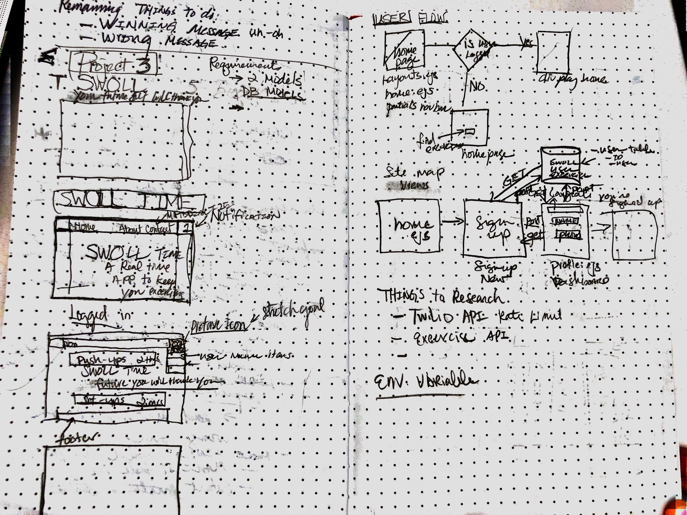

# Swoll time, your future self will thank you
=====
Working out is hard, so this app will allow

## Instructions
Have an excercise that you need a stronger reminder for?  
Simply log on, setup a user profile and schedule it so you don't forget!

## Planning
User Stories:
As a out-of-shape-person, I need to schedule my workouts, so I won't forget them

 

## Technologies Used
* Node.js
* Express
* Sequelize
* postgres
* HTML/CSS (Boot Strap framework)
* Yelp Fusion API

# Approach Taken
* Start the progress by buiding the basic HTML mockup!
* Create database and models based on the sketches
* Pre-populate the database with mocked data
* Build the client side db get calls (Get routes)
* Build the ejs data calls to display the mocked data
* Flesh out the database POST routes

# Issues
* Understanding routes.... like actually understanding them.  Referencing routes and links and understanding how to data passes back and forth between the frontend vs. backend
* 

# Unsolved Problems
* Fleshing the out how to make the twilio API work with the datasets in my db

# Next Steps
* Do some additional research on the twilio API and find out how to find a solution that will let me send a text in the future.